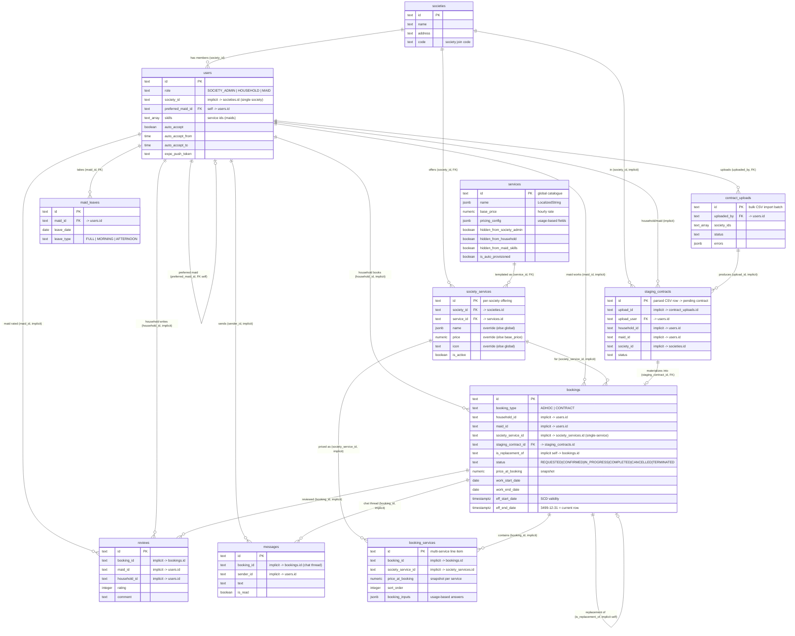

# Kamon / SevaConnect — Data Model

Entity-relationship diagram of the live PostgreSQL schema (Neon, project `purple-cake-21252356`).
Generated from the database; key columns shown (not every column).

> **Important:** Only **7** relationships are enforced by real foreign-key constraints (solid lines below).
> The rest are **application-level** relationships — the column exists and the code joins on it, but the
> database does **not** enforce referential integrity. These are marked _(implicit)_.

## Key design notes

- **One `users` table for all roles**, discriminated by `role` (`SOCIETY_ADMIN`, `HOUSEHOLD`, `MAID`).
  Society membership is a single `society_id` — a user belongs to exactly one society.
- **Global catalogue vs per-society:** `services` is the global template; `society_services` is a
  society's activation of a service with optional overrides (price/name/icon/description). Effective value =
  override when present, else the global value. When `services.hidden_from_society_admin` is true, the
  override is ignored and the global catalogue value is used.
- **Bookings** are `ADHOC` or `CONTRACT` (`booking_type`). A booking carries a single legacy
  `society_service_id` **and** one-or-more `booking_services` rows (multi-service). Prices are **snapshotted**
  into `price_at_booking` at creation, so later catalogue/override changes don't alter past bookings.
- **SCD-style history:** `bookings.eff_start_date` / `eff_end_date` version a booking; the current row has
  `eff_end_date = '3499-12-31'`. Most queries filter on that sentinel.
- **Bulk contract pipeline:** `contract_uploads` (one CSV batch) → many `staging_contracts` (parsed rows) →
  each materializes into a `bookings` row (`staging_contract_id`).
- **Referential integrity is mostly app-enforced.** Only `society_services`, `maid_leaves`,
  `contract_uploads`, `staging_contracts.upload_user`, `bookings.staging_contract_id`, and
  `users.preferred_maid_id` have real FK constraints. Core links like `bookings.maid_id → users.id` are
  **not** DB-enforced — worth knowing if you ever clean up orphaned rows.
