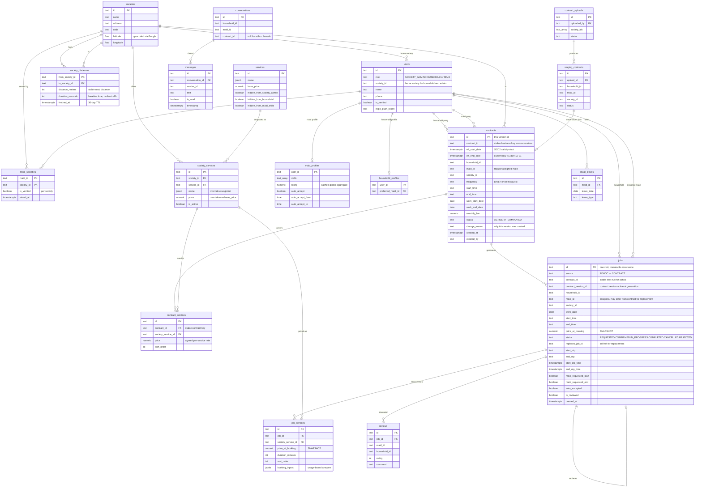

# Data Model v2 — Proposal

Goal: split the overloaded `bookings` table into modular entities, make **adhoc** and **contracts**
first-class, keep point-in-time history, support **maids in multiple societies**, and add a
**location/distance** layer. Decisions locked with the team:

| Decision | Choice |
|---|---|
| Contract vs visits | **Contracts agreement + per-visit `jobs`** |
| Contract change history | **SCD Type 2** versioned rows with `eff_start/eff_end` |
| Bookings = combination of services | **Always** via `job_services` line items (no single-service column) |
| Distance | **Google Distance Matrix, cached** — society lat/long + `society_distances` |
| Multi-society maids | **Membership only** via `maid_societies`; identity/skills/rating global |
| Chat | **`conversations`** threads between users |
| Contract pricing | **`monthly_fee` is source of truth**; `contract_services` lines itemise |
| Profiles | **Split** `maid_profiles` / `household_profiles` off `users` |
| Foreign keys | **Enforced** throughout v2 |
| Migration | **Greenfield wipe + reseed** (test-only data, branch first) |
| Distance freshness | Geocode **on society registration**; cache distance **30 days** |

---

## New ERD

> Diagram note: Mermaid's `erDiagram` rejects parentheses and pipes inside attribute comments and only
> allows `PK`/`FK`/`UK` key tags — comments here are kept plain for that reason. Composite keys
> (`society_distances`, `maid_societies`) and FK columns are described in the table definitions below.

---

## How each requirement is satisfied

### 1. Adhoc vs contracts — modular, both first-class
- **`contracts`** = the recurring agreement: parties, schedule, fee, validity. One conceptual contract,
  versioned over time via SCD2.
- **`jobs`** = every actual unit of work. `source = ADHOC` for one-offs or `source = CONTRACT` for a visit
  generated from a contract. Adhoc and contract visits share the **same operational shape** — status, OTP,
  assigned maid, price snapshot — so the app, calendar, and reporting treat "a job" uniformly. That uniform
  job is the modularity win.

### 1a. Bookings as a combination of services — first-class
- **A job has no single `service_id`.** Services attach *only* through **`job_services`** line items, so a
  job is always "1..N services" — a single-service booking is just a job with one line. This removes the
  legacy `bookings.society_service_id` + `booking_services` duality that causes bugs today.
- Each `job_services` line snapshots its own `price_at_booking` (and usage-based `booking_inputs`); the job
  total is the **sum of its lines**. Pricing, display, and reporting roll up the same way whether a booking
  has one service or five.
- **Contracts mirror this** via **`contract_services`** — a recurring contract can cover several services,
  and the jobs it generates inherit those lines as `job_services`. Symmetry between adhoc and contract paths
  keeps the model modular and avoids special-casing.

### 2. Contract changes — SCD Type 2
- `contracts` keeps the `eff_start_date / eff_end_date` versioning you already use; the current row has
  `eff_end_date = '3499-12-31'`. A change to price, schedule, or maid closes the current row and inserts a
  new version with a `change_reason`.
- `contract_id` is the **stable business key** across versions; `id` identifies a single version.
- "Contract as it is now" filters on the sentinel — identical to the current pattern, so no new mental model.

### 3. Historical info preserved
- **Jobs are immutable occurrences.** Each job snapshots `price_at_booking`, `start_time`, `end_time`, and
  `work_date` at creation; `job_services` snapshots per-line price. Later catalogue or contract changes never
  alter past jobs.
- For "what did the contract say when this job ran", each job stores `contract_version_id` pointing to the
  exact contract version active at generation.

### 4. Replacement logic
- A replacement is a **new job** with `replaces_job_id` set to the original, assigned to a different maid,
  same household/time/service, fresh price snapshot. The original job becomes `CANCELLED` or `REJECTED`.
- For contracts, `contracts.maid_id` (the regular maid) is untouched — only that occurrence's job is
  reassigned. This cleanly implements the "suggest top replacement maids after cancellation" rule.

### 5. Maids in multiple societies
- **`maid_societies`** with `maid_id`, `society_id`, `is_verified`, `joined_at` is the many-to-many
  membership. Maid identity, skills, rating, auto-accept, and leaves stay **global** in `maid_profiles`.
- `users.society_id` now applies only to households/admins; a maid's society set comes from `maid_societies`.
- Availability for a society = maids where a verified `maid_societies` row exists for that society.

### 6. Distance between societies
- `societies` gains `latitude` / `longitude`, **geocoded once on society registration** (admin saves an
  address → call Google Geocoding API → store coordinates). _Geocoding_ = converting a postal address into
  lat/long. One-time per society.
- **`society_distances`** caches Google Distance Matrix results keyed by `from_society_id` + `to_society_id`.

**Distance vs. travel time — important distinction:**

- **`distance_meters` (road distance)** between two fixed locations is essentially constant → safe to cache.
  **30-day TTL**, recomputed if either society's coordinates change.
- **`duration_seconds` (travel time)** is stored only as the **baseline** value (Google's `duration`, with
  **no live traffic**). It's stable enough to cache and is fine for matching/ranking ("are A and B close").
- **Traffic-aware ETAs are deliberately NOT in this cache.** Real travel time varies by traffic, time of day,
  and weekday. Google only returns `duration_in_traffic` when you pass a specific `departure_time`, and that
  value is meaningful only for that moment. So if/when we need an accurate per-trip ETA ("~25 min away for a
  9 AM Tuesday job"), it is a **live, on-demand Distance Matrix call** using the job's start as
  `departure_time` — computed when needed, optionally micro-cached by from/to/weekday/hour bucket, and never
  stored in the 30-day cache.

**v1 scope:** build the stable `distance_meters` + baseline `duration_seconds` cache for **nearby-society
matching/ranking and zone grouping**. Live traffic-aware per-job ETAs are a documented **future add-on**, not
part of the initial cache.

> **Dependency:** Geocoding + Distance Matrix require a **Google Maps API key** (billable; generous free
> tier). Until one is configured, the schema still works — `latitude`/`longitude` can be entered manually and
> distance falls back to straight-line (Haversine) from the stored coordinates.

---

## Operational notes

- **Job generation from contracts.** Don't pre-generate infinite future visits. A daily cron materializes
  contract jobs on a **rolling horizon**, e.g. the next 30–45 days. This bounds row growth while keeping each
  visit a real, trackable record.
- **Chat threading.** Introduce `conversations` — a household-to-maid thread, optionally tied to a contract —
  so messages aren't orphaned per-booking. Simpler fallback: keep a `job_id` on messages.
- **Modular profiles.** Splitting `maid_profiles` / `household_profiles` off `users` keeps role-specific
  columns out of the shared identity table. Optional; can be skipped to reduce migration size.

## Migration path — chosen: greenfield wipe + reseed

The live DB is entirely test/seed data (2 societies, 18 users, 29 bookings, 0 reviews), so we **drop the old
schema and build v2 clean** — no backfill scripts, FKs enforced from day one, no legacy columns.

1. **Branch first.** Create a Neon branch (instant backup / rollback) and build + validate v2 there before
   touching the primary branch.
2. **DDL migration** — `CREATE TABLE` for all v2 tables with FK constraints + indexes.
3. **Seed script** (replaces the scattered `migrate-*.ts`): global services catalogue with all 7-language
   translations + system services (Contract, Replacement, General Help); a couple of societies with lat/long;
   their `society_services`; an admin + a few test users.
4. **Rewrite the backend** `database.ts` service functions to the v2 tables.
5. **Cut over**: point the app at the v2 branch (or promote it). Drop the old tables only after confirmation —
   destructive `DROP`s shown for explicit approval first.
6. Testers re-register (fine for closed beta).

## Resolved decisions

1. **Chat** → dedicated **`conversations`** threads between users; `messages` reference `conversation_id`.
2. **Contract pricing** → `contracts.monthly_fee` is the **source of truth**; `contract_services` lines exist
   for itemisation/display only (not summed to derive the fee).
3. **Profiles** → **split** `maid_profiles` / `household_profiles` off `users`.
4. **Foreign keys** → **enforced** throughout v2.
5. **Distance** → geocode **on society registration**; cache `distance_meters` + baseline `duration_seconds`
   with a **30-day TTL**. Traffic-aware per-job ETAs are an **on-demand** lookup (live `departure_time`), kept
   out of the cache — a future add-on. Requires a Google Maps API key; manual lat/long + Haversine is the
   fallback until one is configured.

## Remaining input before DDL

- **Google Maps API key**: do you already have a Google Cloud project/key for Geocoding + Distance Matrix, or
  should v1 ship with the manual-coordinates + straight-line fallback and wire the API later?
- **Live traffic ETAs**: confirm these are a future add-on (recommended), not a near-term requirement.
